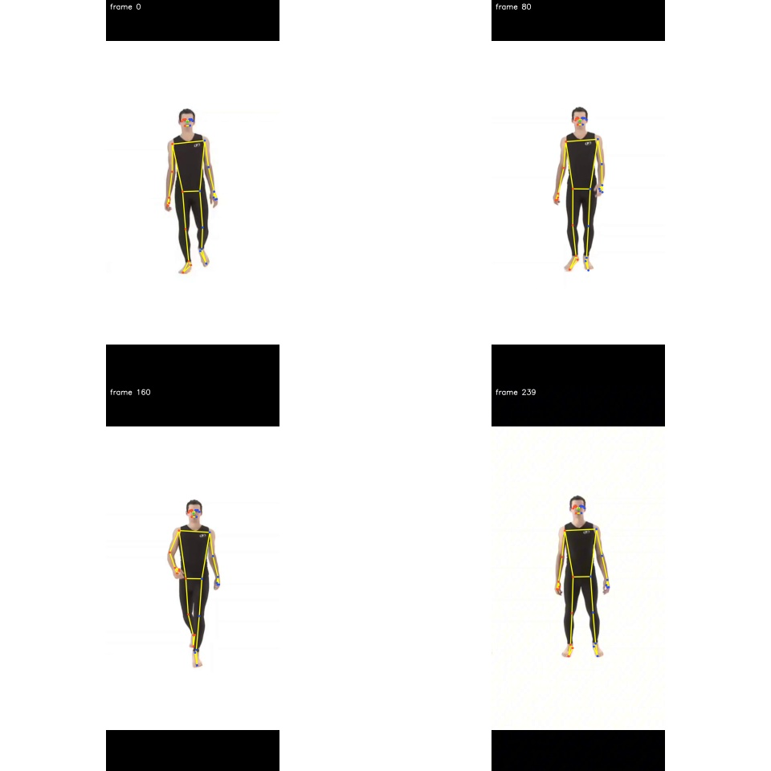
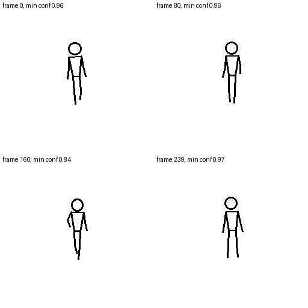
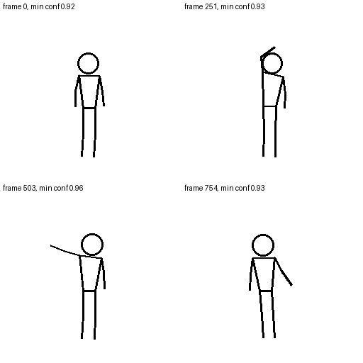
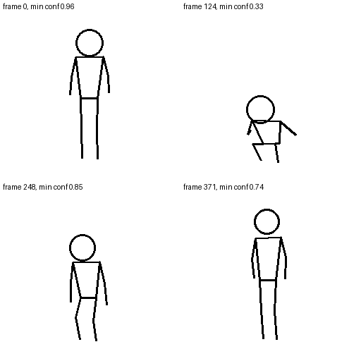
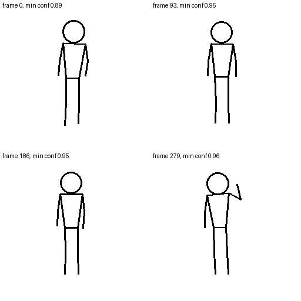
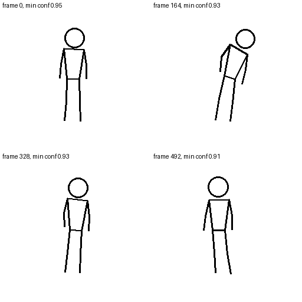
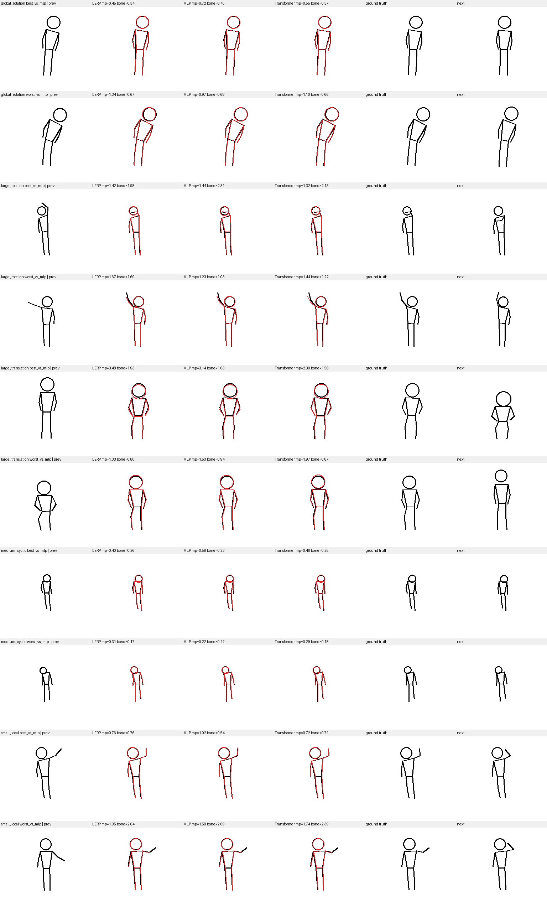
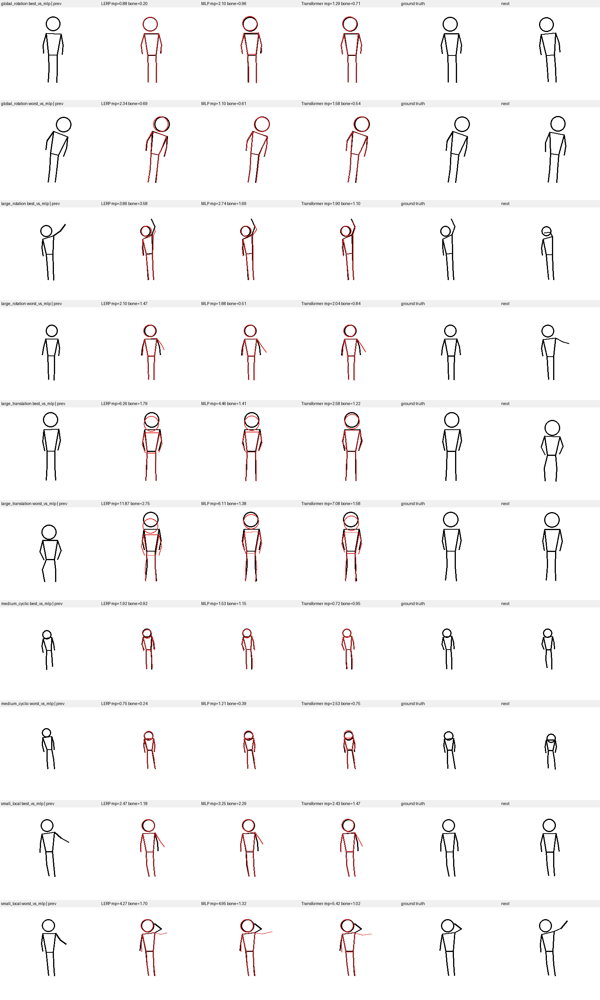

# Tweener Stickman（火柴人插帧）

给 [Krita](https://krita.org/) 用的火柴人**中间帧**实验项目（v0.1）。

当前可用链路：

**结构化姿态 JSON → 本机 HTTP（Transformer）→ PNG → Krita 图层**

<p align="center">
  
</p>

<p align="center"><em>连续走路序列：预测（红）叠在真值（黑）上</em></p>

> 已知限制：MediaPipe **不能**从火柴人线稿 PNG 可靠提取关键点；任意 PNG 输入尚未打通。

---

## 它在解决什么问题

动画里两张关键帧之间要补中间帧。本项目把问题降维成：

1. 用真人视频 + MediaPipe 得到 COCO-17 姿态
2. 渲染成火柴人线稿作为监督
3. 用左右各 3 帧姿态，预测正中间一帧（stride = 2 / 4 / 8）
4. 通过 HTTP / Krita 插件把结果贴回画布

---

## 数据长什么样

### 真人帧 → 火柴人（训练监督）

| 真人原图（MediaPipe 输入） | 渲染火柴人（COCO-17） |
| --- | --- |
|  |  |

### 五种动作

| walk | swing | squat | wave | lean |
| --- | --- | --- | --- | --- |
|  |  |  |  |  |

运动类型大致对应：`walk=medium_cyclic`，`swing=large_rotation`，`squat=large_translation`，`wave=small_local`，`lean=global_rotation`。

### 训练样本：三连帧（prev / gt / next）

| prev | gt（要预测的中间帧） | next |
| --- | --- | --- |
|  |  |  |

正式序列设定：`context=k=3`（左右各 3 帧），三个时间间隔：

- `s2`：左右偏移 `[-4,-3,-2]` / `[+2,+3,+4]`
- `s4`：`[-6,-5,-4]` / `[+4,+5,+6]`
- `s8`：`[-10,-9,-8]` / `[+8,+9,+10]`

样本规模：train `938/448/202 = 1588`，val `698/336/154 = 1188`。  
训练/验证视频是分别录制的（`*_train_001.mp4` / `*_val_001.mp4`）。

---

## 怎么训练的（流程）

```text
真人视频
  → extract_poses.py          # MediaPipe → COCO-17
  → make_real_sequences.py    # 组成 k=3 序列样本
  → train_sequence.py         # Transformer：预测相对 LERP 的残差
  → evaluate_sequence.py      # MPJPE / 骨长误差
```

正式模型（已随仓库提供）：

- 权重：`checkpoints/sequence_transformer_k3_best.pt`（epoch 21）
- 结构：`d_model=96`，`heads=4`，`layers=2`，约 `166k` 参数
- 输出：相对线性插值（LERP）的残差；输出层零初始化

宏平均相对 LERP：MPJPE 约改善 **10.3%**，骨长误差约改善 **7.8%**（收益主要在 `s4/s8`；`s2` 没有稳定超过 LERP）。

更细的设计见 `火柴人插帧.md`，阶段断点见 `交接_20260903.md`。

---

## 结果示意

### Transformer 正式评测（最好 / 最差案例）

**s4**



**s8**



### 单帧推理：预测 vs 真值（s8）

| prediction | target |
| --- | --- |
|  |  |

### 已完成阶段

- **v0–v4**：合成基线、真人数据、MLP、Transformer、Raster U-Net 实验
- **v5a–v5e**：Python API、CLI、批量、HTTP 服务
- **v5f（最小）**：Krita 插件 Demo（health + interpolate → 当前文档图层）

v5 默认后端是 **Transformer**；Raster 仅作实验对照（线条拓扑不如坐标路线稳）。

---

## 环境

- Python 3.11+
- PyTorch（建议 CUDA）
- 正式权重：`checkpoints/sequence_transformer_k3_best.pt`

通用安装示例：

```bash
pip install torch numpy pillow opencv-python mediapipe
```

---

## 启动服务

在项目根目录：

```bash
python -m server.app \
  --device cuda \
  --port 8765 \
  --checkpoint checkpoints/sequence_transformer_k3_best.pt
```

健康检查：

```bash
curl -s http://127.0.0.1:8765/health
```

默认只监听 `127.0.0.1`，不要改成 `0.0.0.0`。

主要接口：

- `GET /health`
- `POST /v1/stickman/interpolate`
- `POST /v1/stickman/interpolate-batch`

示例请求：`krita_plugin/examples/tweener_request.json`

---

## Krita 插件

1. 复制到 Krita 的 `pykrita` 目录：
   - `krita_plugin/tweener_health.desktop`
   - `krita_plugin/tweener_health/`
2. macOS 常见路径：`~/Library/Application Support/krita/pykrita/`
3. 复制示例请求到桌面：

```bash
cp krita_plugin/examples/tweener_request.json ~/Desktop/tweener_request.json
```

4. 确保本机可访问服务（同机直连；远程 GPU 可用端口转发）。
5. 重启 Krita，启用 **Tweener Health**。
6. 菜单：**工具 → 脚本**
   - `Tweener: Check Server`
   - `Tweener: Interpolate Demo`（写入当前文档图层 `Tweener Prediction`）

插件默认 `http://127.0.0.1:8766`；若服务在 `8765`，请改 `__init__.py` 里的 `BASE_URL`。

---

## 仓库说明

| 路径 | 说明 |
| --- | --- |
| `stickman/` | 模型、数据、渲染与请求契约 |
| `server/` | 本机 HTTP 服务 |
| `krita_plugin/` | Krita 最小插件 |
| `checkpoints/` | 正式 Transformer 权重 |
| `docs/assets/` | README 示意图 |
| `火柴人插帧.md` | 设计与阶段说明 |
| `交接_20260903.md` | 当前交接与断点 |

未纳入版本库（见 `.gitignore`）：完整 `data/`、`runs/`、Krita AppImage。

---

## 下一步（未做）

- 时间轴多帧动画闭环
- 自研「渲染图 → 17 关键点」以支持 PNG 输入
- 任意 `n` / 连续时间插帧
- 单元测试

---

## License

MIT。详见仓库根目录 `LICENSE`。
